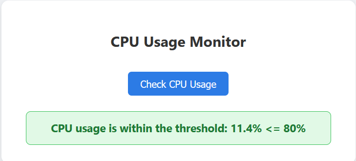

# 🖥️ CPU Usage Monitor

A simple Flask-based web application to monitor the current CPU usage of the system and check if it exceeds a predefined threshold. Designed for quick diagnostics and basic system monitoring.

---

## 📋 Features

- Web-based interface to check real-time CPU usage
- Threshold-based alert system
- Clean, responsive UI with status display
- Easy to deploy with Flask

---

## 🚀 How It Works

1. When the user clicks the **"Check CPU Usage"** button on the webpage, the app uses the `psutil` library to measure CPU usage.
2. It compares the usage against a defined threshold (`80%` by default).
3. It displays a **green status message** if the usage is normal, or a **red alert** if the threshold is exceeded.

---

## 🛠️ Technologies Used

- Python 3
- Flask
- HTML5, CSS3
- psutil (for CPU stats)

---

## 🧾 Requirements

Make sure you have the following installed:

- Python 3.12+
- pip (Python package manager)

Install required Python packages:

```bash
pip install flask psutil

## Project Structure

cpu_monitor/
├── app.py             # Main Flask application
├── templates/
│   └── index.html     # Web UI Template
└── README.md          # Project documentation

## How to Run
```
git clone https://github.com/sainathislavath/Cpu_Monitor.git

cd Cpu_Monitor

### Install dependencies

pip install flask psutil

### Run the application

python app.py

### Open in Browser

http://127.0.0.1:5000/

